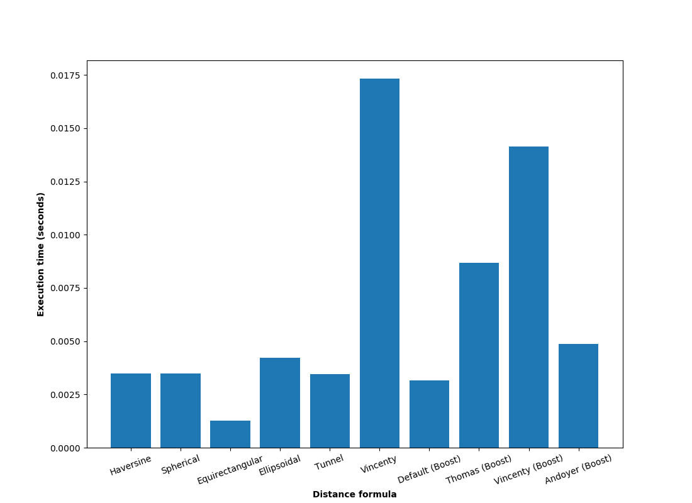

# boost-geometry-proposal
This repository contains the programming competency task for the Boost organization.

## GeoLib

### Introduction

 This library provides functions for calculating the geographical
 distance between two points on the Earth's surface.

 The user has the ability to define their custom point type to be
 used for distance computation. We employ traits for accessing
 structure elements. Therefore, these have to be specialized
 by the library user. An example structure is shown below:

 ```cpp
 struct CustomPoint
 {
   CustomPoint(double latitude, double longitude) :
     latitude(latitude),
     longitude(longitude) {}
   double latitude, longitude;
  };
  ```
  This then has to be specialized with the generic functions
  `getRadian` and `getDegree`. We have to implement these in
  the `PointTrait` namespace. An example specialization is
  provided below:

 ```cpp
 namespace PointTrait
 {
     template <>
     struct AccessPoint<CustomPoint, 0>
     {
         static double getRadian(CustomPoint const& p)
         { return p.latitude * M_PI / 180; }

         static double getDegree(CustomPoint const& p)
         { return p.latitude; }
     };
     template <>
     struct AccessPoint<CustomPoint, 1>
     {
         static double getRadian(CustomPoint const& p)
         { return p.longitude * M_PI / 180; }

         static double getDegree(CustomPoint const& p)
         { return p.longitude; }
     };
 }
 ```

 To see this in action, please refer to the [tests/geodistance_test.cpp](https://github.com/adl1995/boost-geometry-proposal/blob/make-generic/geolib/tests/geodistance_test.cpp) file.


### Build instructions
First clone the repository with the following command:
```bash
$ git clone https://github.com/adl1995/boost-geometry-proposal.git
```
Then, `cd` into the cloned repository by:
```bash
$ cd boost-geometry-proposal
$ cd geolib
```
To compile the library, first create a build directory:
```bash
$ mkdir build
$ cd build
```
The next step is to run CMake to configure the project:
```bash
$ cmake ../
```
Once CMake is configured, the library can be built by typing `make`. This will build the 'geolib_tests' component:
```bash
$ make
```
The tests can be run by typing:
```bash
$ make tests
```
To build the documentation using Doxygen, type:
```bash
$ make docs
```
Finally, the HTML documentation can be opened with Firefox by typing:
```bash
$ firefox docs/html/index.html
```

### Results

For benchmarking, we calculate the average execution time over all the distance algorithms. The dataset used is: [Test set for geodesics](https://zenodo.org/record/32156#.WrIxxeaYPrf), by Karney, Charles. For the purpose of this demonstration, only 15000 entries are used for testing.

The bar chart below tries to visually compare the average execution time for each distance formula. This was calculated using the g++ compiler (version 7.2.0 on Ubuntu 14.04) with the O1 optimization level:


